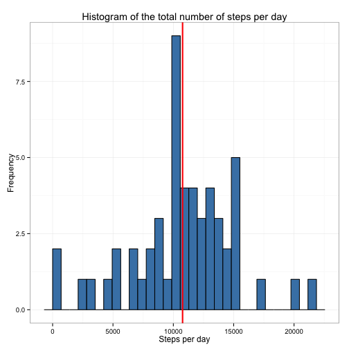
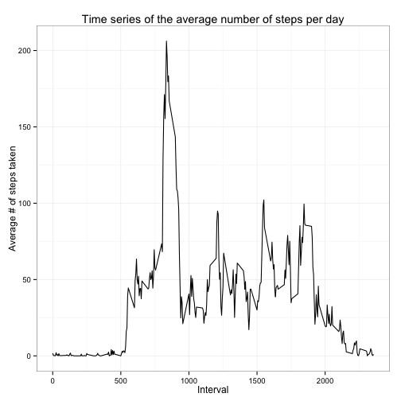
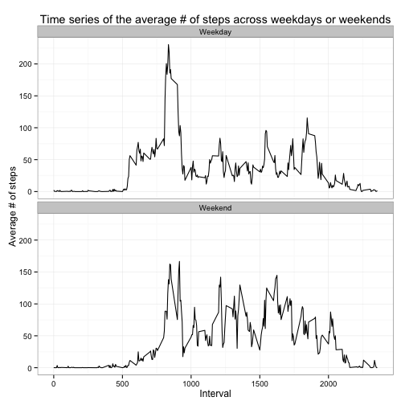

Reproducible Research: Peer Assessment 1
========================================
Github repo, data and RMarkdown files found at: www.github.com/Pettengill/RepData_PeerAssessment1  

### Loading and preprocessing the data
1. Load the data


```r
unzip("repdata-data-activity.zip")
```

```
## Warning: error 1 in extracting from zip file
```

```r
act <- read.csv("activity.csv")
```

```
## Warning: cannot open file 'activity.csv': No such file or directory
```

```
## Error: cannot open the connection
```

2. Process/transform the data (if necessary) into a format suitable for your analysis

```r
act$date <- as.Date(act$date, "%Y-%m-%d")
```

### What is mean total number of steps taken per day?
1. Make a histogram of the total number of steps taken each day

```r
library(ggplot2)
stpsday <- aggregate(steps ~ date, data = act, FUN = sum, na.rm = TRUE)
ggplot(stpsday, aes(x=steps)) + 
        geom_histogram(color="black", fill = "steelblue") +
        geom_vline(aes(xintercept = mean(steps, na.rm= TRUE)), col = "red", size=1) +
        xlab("Steps per day") +
        ylab("Frequency") +
        ggtitle("Histogram of the total number of steps per day") +
        theme_bw()
```

 

2. Calculate and report the mean and median total number of steps taken per day


```r
mean(stpsday$steps)
```

```
## [1] 10766
```

```r
median(stpsday$steps)
```

```
## [1] 10765
```

*Answer: The mean is 10766 and the median is 10765*

### What is the average daily activity pattern?

1. Make a time series plot (i.e. type = "l") of the 5-minute interval (x-axis) and the average number of steps taken, averaged across all days (y-axis)

```r
time <- aggregate(steps ~ interval, data = act, FUN = mean, na.rm = TRUE)
ggplot(data = time, aes(x=interval, y=steps)) + 
        geom_line() +
        xlab("Interval") +
        ylab("Average # of steps taken") +
        ggtitle("Time series of the average number of steps per day") +
        theme_bw()
```

 

2. Which 5-minute interval, on average across all the days in the dataset, contains the maximum number of steps?


```r
max_i <- which.max(time$steps)
time[max_i,]
```

```
##     interval steps
## 104      835 206.2
```

*Answer: The interval 835 has the max number of average steps: 206.2*

### Imputing missing values

1. Calculate and report the total number of missing values in the dataset (i.e. the total number of rows with NAs)

```r
NAsIn_act <- sum(is.na(act))
NAsIn_act
```

```
## [1] 2304
```

*Answer: There are 2304 missing values in the dataset*

2. Devise a strategy for filling in all of the missing values in the dataset. The strategy does not need to be sophisticated. For example, you could use the mean/median for that day, or the mean for that 5-minute interval, etc.


```r
filler <- numeric()
for (i in 1:nrow(act)) {
        int <- act[i,]
        if (is.na(int$steps)) {
                sub <- subset(time, interval == int$interval)$steps
                } else {
                        sub <-int$steps
                }
                filler <-c(filler, sub)
        }
```

3. Create a new dataset that is equal to the original dataset but with the missing data filled in.


```r
act2 <- act
act2$steps <-filler
head(act)
```

```
##   steps       date interval
## 1    NA 2012-10-01        0
## 2    NA 2012-10-01        5
## 3    NA 2012-10-01       10
## 4    NA 2012-10-01       15
## 5    NA 2012-10-01       20
## 6    NA 2012-10-01       25
```

```r
head(act2)
```

```
##     steps       date interval
## 1 1.71698 2012-10-01        0
## 2 0.33962 2012-10-01        5
## 3 0.13208 2012-10-01       10
## 4 0.15094 2012-10-01       15
## 5 0.07547 2012-10-01       20
## 6 2.09434 2012-10-01       25
```

4. Make a histogram of the total number of steps taken each day and calculate and report the mean and median total number of steps taken per day. Do these values differ from the estimates from the first part of the assignment? What is the impact of imputing missing data on the estimates of the total daily number of steps?

```r
stpsday2 <- aggregate(steps ~ date, data = act2, FUN = sum, na.rm = TRUE)
ggplot(stpsday, aes(x=steps)) + 
        geom_histogram(color="black", fill = "steelblue") +
        geom_vline(aes(xintercept = mean(steps, na.rm= TRUE)), col = "red", size=1) +
        xlab("Steps per day") +
        ylab("Frequency") +
        ggtitle("Histogram of the total number of steps per day") +
        theme_bw()
```

 

```r
mean(stpsday2$steps)
```

```
## [1] 10766
```

```r
median(stpsday2$steps)
```

```
## [1] 10766
```
*Answer: After imputation, the mean and median are both 10766. Before imputation the mean was 10766 and the median was 10765*

### Are there differences in activity patterns between weekdays and weekends?

1. Create a new factor variable in the dataset with two levels – “weekday” and “weekend” indicating whether a given date is a weekday or weekend day.


```r
act2$date <- as.Date(act2$date, "%Y-%m-%d")
act2$day <- weekdays(act2$date)
act2$daytype <-  c("Weekday")
for (i in 1:nrow(act2)) {
        if (act2$day[i] == "Saturday" || act2$day[i] == "Sunday") {
                act2$daytype[i] <- "Weekend"
                }
        }
act2$daytype <- as.factor(act2$daytype)
```

2. Make a panel plot containing a time series plot (i.e. type = "l") of the 5-minute interval (x-axis) and the average number of steps taken, averaged across all weekday days or weekend days (y-axis).  

```r
time2 <- aggregate(steps ~ interval + daytype, data = act2, FUN = mean)
ggplot(data = time2, aes(x=interval, y=steps)) + 
     geom_line() +
     facet_wrap(~daytype, ncol = 1) +
     xlab("Interval") +
     ylab("Average # of steps") +
     ggtitle("Time series of the average # of steps across weekdays or weekends") +
     theme_bw()
```

 

*Answer: Yes, there are differences in activity patterns between weekdays and weekends*
